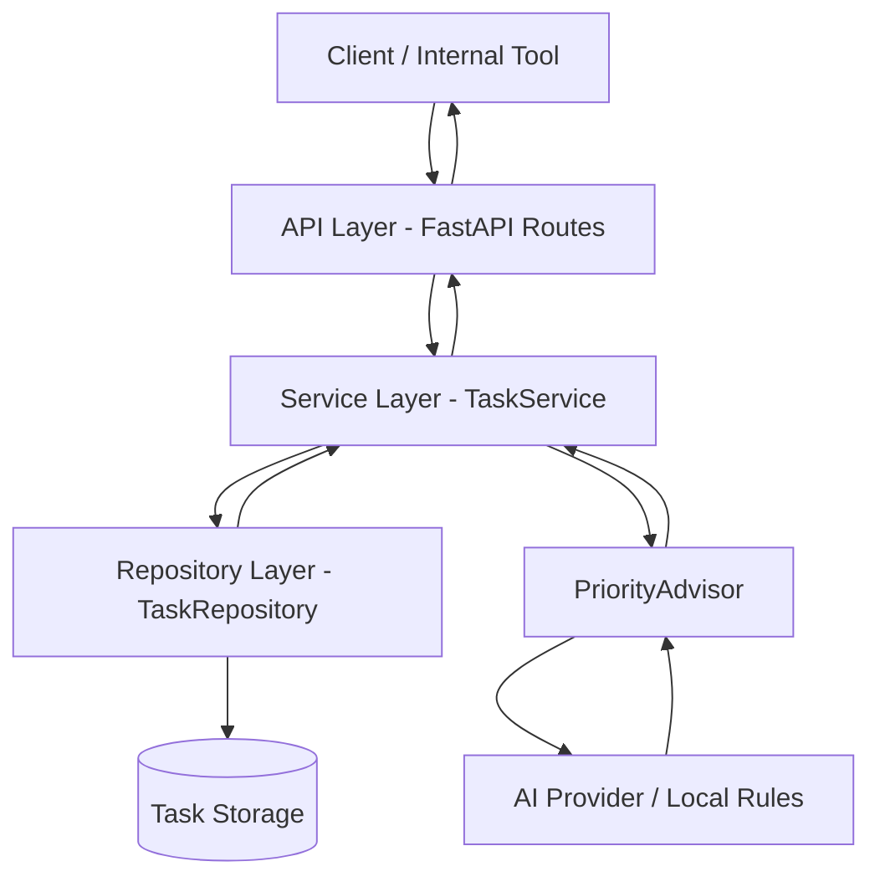

```mermaid
flowchart TD
    Client[Client / Internal Tool] --> API[API Layer - FastAPI Routes]
    API --> Service[Service Layer - TaskService]
    Service --> Repository[Repository Layer - TaskRepository]
    Repository --> Storage[(Task Storage)]

    Service --> Advisor[PriorityAdvisor]
    Advisor --> AIProvider[AI Provider / Local Rules]

    AIProvider --> Advisor
    Advisor --> Service
    Repository --> Service
    Service --> API
    API --> Client
```
